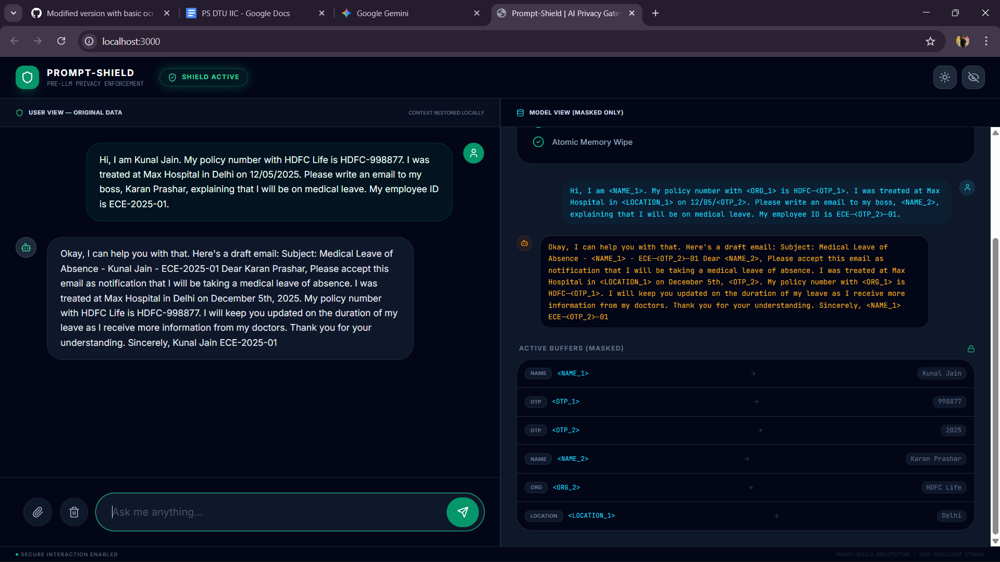

# PromptShield

Privacy-preserving AI chat interface that masks sensitive data **before** it reaches the LLM.

PromptShield acts as a security firewall between users and GPT/LLM APIs, ensuring personal information never leaves the system.

---

## 🚨 Problem

People regularly paste real-world information into AI tools without thinking.

While using ChatGPT or other LLMs, users often accidentally include:

- Names
- Emails
- Phone numbers
- Addresses
- Employee IDs
- Medical or financial details
- Internal company or confidential data

Because prompts are sent directly to external APIs, this sensitive information leaves the device and reaches third-party servers.

This creates serious **privacy, security, and compliance risks**, especially for workplaces, healthcare, or enterprise use.

Today, most AI tools rely on user caution — not technical safeguards.

There is **no architectural guarantee** that personal data is protected before reaching the model.

---

## 💡 Solution

PromptShield acts like a **privacy firewall** between the user and the AI model.

Before any prompt leaves the device, the system automatically scans it for sensitive information and masks it.

So even if a user accidentally pastes personal or confidential data, the AI **never sees the real values**.

### How it works

User → Masking → LLM → Rehydration → User

- Detects sensitive data in real time
- Replaces it with placeholders (`<NAME_1>`, `<PHONE_1>`)
- Sends only masked text to the model
- Restores the original values locally after the response

### Split Architecture

- LEFT → Human view (real data)
- RIGHT → Model view (masked data only)

This guarantees that **no personal data ever leaves the system**.

Privacy is enforced **by architecture, not policy**.

---

## 🖼 Demo



---

## ✨ Features

- 🔒 Real-time sensitive data masking
- 🧠 Works with Gemini / OpenAI / any LLM
- 🔁 Deterministic rehydration
- 🧩 Split-screen privacy visualization
- ⚡ Fast local processing
- 🛡 Zero raw data sent to APIs
- 🧾 Security audit logging
- 🔍 Optional OCR support

---

## 🛠 Tech Stack

### Frontend
- React
- TypeScript
- Vite

### Backend
- FastAPI
- Python

### AI
- Gemini / OpenAI APIs

---

## 📂 Project Structure

backend/
app/
masking.py
mask_pipeline.py
routes/
security/
main.py

frontend/
components/
services/
public/assets/demo.png
App.tsx
index.tsx

README.md


---

## ⚙️ Installation

### 1️⃣ Clone

```bash
git clone <repo-url>
cd prompt-shield
2️⃣ Backend Setup
python -m venv venv
venv\Scripts\activate      # mac/linux: source venv/bin/activate

pip install -r requirements.txt
uvicorn main:app --reload --port 8000
Backend runs at: http://localhost:8000

3️⃣ Frontend Setup
cd frontend
npm install
npm run dev
Frontend runs at: http://localhost:3000

🔑 Environment Variables
Create a .env file inside backend/:

GEMINI_API_KEY=your_key
OPENAI_API_KEY=your_key


🚀 Usage
Start backend

Start frontend

Enter text in LEFT screen

Masked content is sent to the modelUser → Masking → LLM → Rehydration → User


- Detects sensitive data in real time
- Replaces it with placeholders (`<NAME_1>`, `<PHONE_1>`)
- Sends only masked text to the model
- Restores the original values locally after the response

### Split Architecture

- LEFT → Human view (real data)
- RIGHT → Model view (masked data only)

This guarantees that **no personal data ever leaves the system**.

Privacy is enforced **by architecture, not policy**.

Response is rehydrated locally

No personal data ever leaves the system.

🔌 API
POST /chat
Send masked prompt to model

GET /health
Health check endpoint

🤝 Contributing
Pull requests are welcome.
Please open an issue before major changes.

📜 License
MIT License